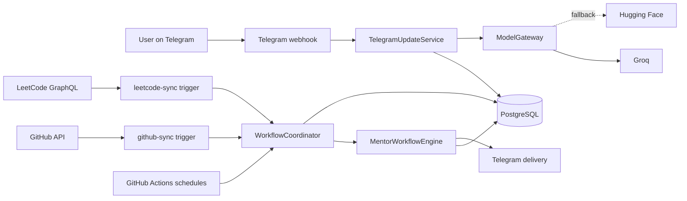
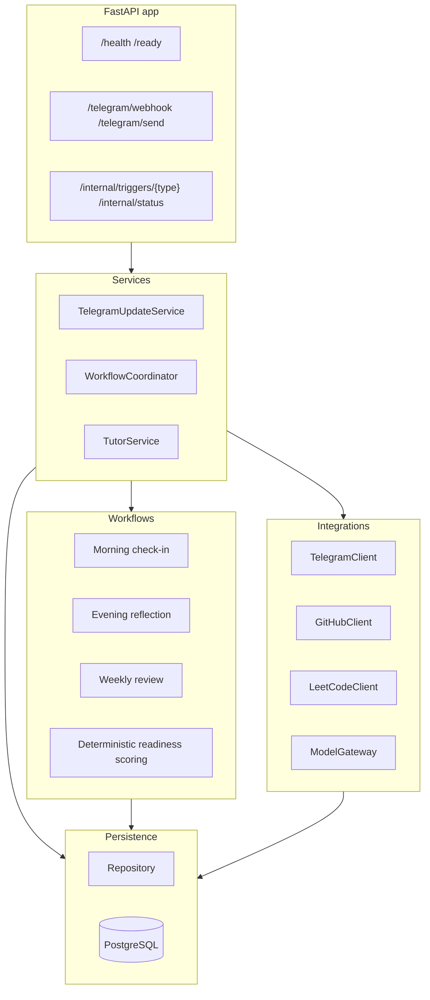
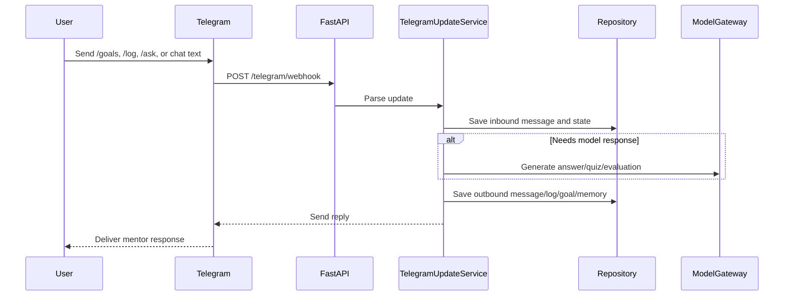
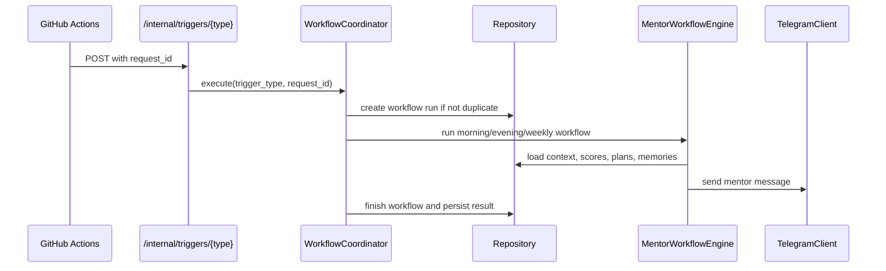
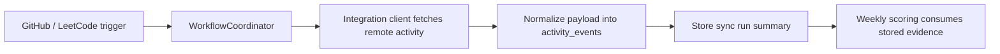

# PathwayAI

PathwayAI is an open-source mentor backend that turns your real work into interview-readiness coaching. It watches signals like Telegram reflections, GitHub activity, and optional LeetCode practice, stores that evidence in PostgreSQL, and runs scheduled morning, evening, and weekly workflows to coach you over time instead of acting like a stateless chatbot.

It is built as a FastAPI service with LangGraph-powered workflows, async integrations, deterministic scoring, and a Telegram-first user experience.

## What It Does

- Collects evidence from:
  - Telegram goals, logs, questions, and quiz interactions
  - GitHub commit activity
  - LeetCode accepted submissions and topic coverage
- Stores durable history in PostgreSQL:
  - activity events
  - conversation messages
  - learning logs
  - weekly plans
  - readiness scores
  - memory summaries
- Runs recurring mentor workflows:
  - morning check-in
  - evening reflection
  - weekly review and readiness scoring
- Produces a readiness score from actual evidence instead of self-reported confidence

## End-To-End Flow



## Runtime Architecture



## Repository Map

| Path | Purpose |
|---|---|
| `src/pathwayai_backend/api.py` | FastAPI routes for health, Telegram, tutor messages, and internal triggers |
| `src/pathwayai_backend/services/telegram_updates.py` | Telegram command handling and conversational workflows |
| `src/pathwayai_backend/services/coordinator.py` | Trigger dispatcher, sync execution, idempotency, and workflow lifecycle |
| `src/pathwayai_backend/workflows/mentor.py` | LangGraph-based morning, evening, and weekly mentor workflows |
| `src/pathwayai_backend/workflows/scoring.py` | Deterministic readiness scoring and evidence gap analysis |
| `src/pathwayai_backend/integrations/` | GitHub, LeetCode, and Telegram integrations |
| `src/pathwayai_backend/db/` | SQLAlchemy models, repository layer, and database session management |
| `migrations/` | Alembic migrations |
| `tests/` | Unit and integration-oriented test coverage |
| `.github/workflows/` | CI, deployment, sync, maintenance, and scheduled workflow triggers |

## Main User Workflows

### 1. Telegram interaction flow



### 2. Scheduled mentor flow



### 3. Activity ingestion flow



## Readiness Score Model

The weekly review calculates a deterministic score from evidence gathered during the week.

- `engineering_consistency`: recent GitHub activity days
- `dsa_consistency`: recent LeetCode activity days
- `learning_evidence`: recorded learning logs
- `interview_evidence`: stored interview-assessment memories
- `overall_consistency`: combined GitHub + LeetCode activity spread

Today, DSA evidence comes from LeetCode sync only. If `LEETCODE_USERNAME` is not configured, DSA capture will be absent from the score.

## Local Setup

### Prerequisites

- Python `3.12+`
- `uv`
- PostgreSQL-compatible database
- Telegram bot credentials if you want the chat experience
- Optional API keys for:
  - Groq
  - Hugging Face
  - GitHub
  - LeetCode

### Install

```bash
cp .env.example .env
uv sync --dev
uv run alembic upgrade head
uv run pathwayai-backend
```

The app will start on [http://127.0.0.1:8000](http://127.0.0.1:8000) by default.

Interactive API docs are available at [http://127.0.0.1:8000/docs](http://127.0.0.1:8000/docs).

## Configuration

### Required for core backend

```env
DATABASE_URL=
INTERNAL_TRIGGER_SECRET=
```

### Required for Telegram bot mode

```env
TELEGRAM_BOT_TOKEN=
TELEGRAM_CHAT_ID=
TELEGRAM_WEBHOOK_SECRET=
APP_BASE_URL=
```

### Optional integrations

```env
GITHUB_USERNAME=
GITHUB_TOKEN=

LEETCODE_USERNAME=
LEETCODE_SESSION=
LEETCODE_CSRF_TOKEN=

GROQ_API_KEY=
HUGGINGFACE_API_TOKEN=

SMTP_HOST=
SMTP_PORT=587
SMTP_USERNAME=
SMTP_PASSWORD=
DIGEST_EMAIL_FROM=
DIGEST_EMAIL_TO=
```

Notes:

- `GITHUB_TOKEN` improves GitHub API reliability but the username is the main identity input.
- `LEETCODE_USERNAME` is the key requirement for LeetCode sync in this repo. Session and CSRF values are optional and only added when present.
- If no model provider is configured, some workflows fall back to deterministic canned responses instead of crashing.
- The weekly digest email stays off unless `SMTP_HOST` and `DIGEST_EMAIL_TO` are both set; `DIGEST_EMAIL_FROM` falls back to `SMTP_USERNAME`.

## Telegram Setup

After your app is reachable on a public URL:

```bash
uv run pathwayai-set-webhook
```

This configures Telegram commands and points your bot webhook to:

```text
{APP_BASE_URL}/telegram/webhook
```

## Scheduled Automation

GitHub Actions in `.github/workflows/` handle:

- CI
- deploy hook calls
- morning check-ins
- evening reflections
- weekly reviews
- GitHub/LeetCode activity sync
- data retention maintenance
- backups
- daily nudge for missed logs (20:00 IST)
- weekly prune of old operational rows (after the Sunday backup)
- weekly digest email (Monday morning, when SMTP is configured)

The service itself exposes trigger endpoints; GitHub Actions is only the scheduler.

## Running Tests

```bash
uv run ruff check
uv run pytest
```

For migration verification:

```bash
uv run alembic upgrade head
```

Some database-oriented tests require an isolated test database. Do not point test settings at production.

## Open Source Readiness

This repo is now structured so an outside contributor can understand and run it with:

- a single top-level README
- stable architecture and data docs under `docs/`
- example environment variables in `.env.example`
- Docker and GitHub Actions support
- tests covering core integrations, config, scoring, security, and Telegram workflows

If you plan to publish it broadly, the next recommended steps are:

- add a `LICENSE`
- add a `CONTRIBUTING.md`
- add an architecture decision log if the workflow engine evolves quickly
- add example screenshots or a short demo GIF for the Telegram UX

## Useful Docs

- [Documentation index](./docs/README.md)
- [Quickstart](./docs/quickstart.md)
- [Configuration](./docs/configuration.md)
- [Usage](./docs/usage.md)
- [Deployment](./docs/deployment.md)
