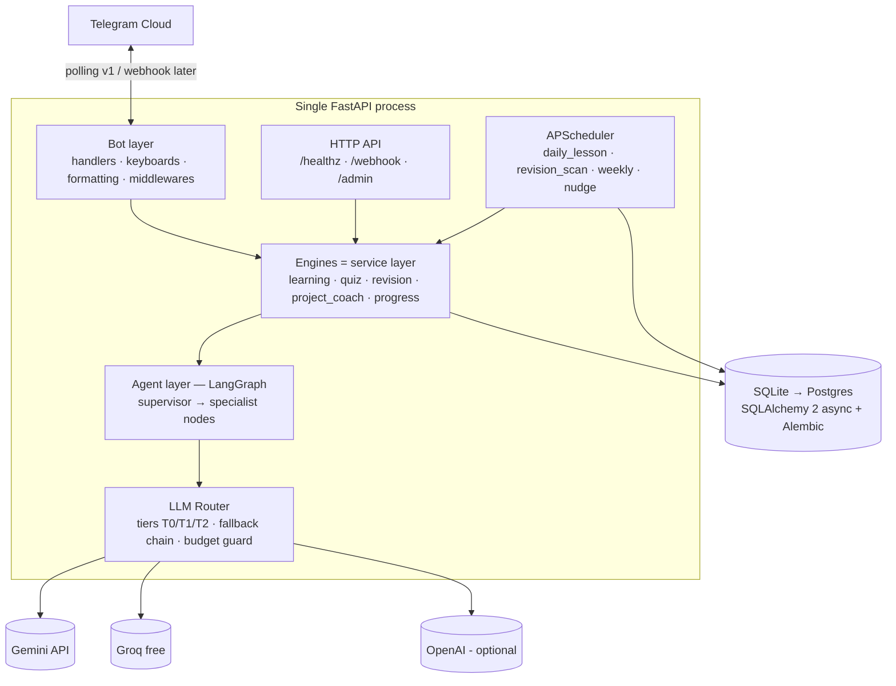
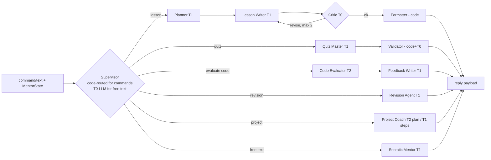

# 02 — Engineering Design: AI Mentor Bot

## 1. Constraints & assumptions

- **Scale:** 1 user (Ayush) → headroom for ~100 before any re-architecture. ~20–40 messages and ~10–15 LLM calls per day.
- **Cost:** $0 target. Gemini free tier primary; Groq free tier fallback; OpenAI optional/paid.
- **Dev machine:** Windows 10; production host TBD (PC with Task Scheduler, or Oracle Cloud Always Free / Fly.io).
- **Maintainer:** a 2nd-year student — favor boring, well-documented tech over clever tech.

## 2. High-level architecture



**Layering rule (enforced by imports):** `bot/` and `scheduler/` may import `engines/`; `engines/` may import `agents/` and `db/`; `agents/` never imports `bot/` or `db/` (it receives plain data, returns validated schemas). This is what makes the M5 LangGraph swap-in safe.

## 3. Component responsibilities

| Component | Responsibility |
|---|---|
| **Bot layer** | Telegram I/O only: parse updates, render messages/keyboards, chunk long text (≤3,500 chars), MarkdownV2 escaping, callback routing, per-user rate limiting, allowlist auth, global error boundary |
| **Engines (service layer)** | All business rules: lesson lifecycle, adaptive thresholds, SRS ladder math, scoring, streak/XP, project step state. Pure-ish async Python — fully unit-testable with a FakeLLM |
| **Agent layer** | Content generation/evaluation via LangGraph. Stateless per call; receives a context dict, returns a Pydantic-validated object |
| **LLM Router** | Model tier selection, provider fallback, JSON-schema validation w/ retry, daily budget guard, usage logging |
| **Scheduler** | Cron jobs with SQLAlchemy jobstore (survives restarts) |
| **HTTP API** | `/healthz`; `/webhook/telegram` (prod-later); token-protected `/admin/*` |

## 4. Multi-agent framework (LangGraph)

### 4.1 Graph



### 4.2 State schema

```python
class MentorState(TypedDict):
    user_profile: dict      # name, difficulty, weak_topics, recent_scores
    intent: str             # lesson | quiz | evaluate | revision | project | chat
    topic: dict | None      # slug, title, phase, variant
    payload: dict           # intent-specific input (submission code, free text, due items)
    draft: dict | None      # writer output awaiting critique
    critique: str | None
    revision_count: int     # critic loop guard (max 2)
    output: dict | None     # final validated schema instance
```

### 4.3 Agents & model tiers

| Agent | Tier | Role | Output schema |
|---|---|---|---|
| Supervisor | code / T0 | Commands route deterministically in code (90% of traffic, zero tokens); T0 classifies free text only | `intent` |
| Planner | T1 | Picks lesson angle: prerequisites, recap-if-flagged, difficulty calibration | `LessonPlan` |
| Lesson Writer | T1 | Generates the 9-section lesson (spec §4) | `LessonSchema` |
| Critic | T0 | Checks: schema-complete, has 2–3 checkpoints, code runs in head, length budget, difficulty match. Pass/fail + notes | `Critique` |
| Quiz Master | T1 | 5 MCQs w/ distractor rationale + per-option explanations | `QuizSchema` |
| Validator | code+T0 | Dedup vs question bank, exactly-one-correct check | `QuizSchema` |
| Code Evaluator | T2 | Rubric-grades exercise/project submissions (correctness, style, edge cases) | `EvalSchema` |
| Feedback Writer | T1 | Turns rubric into encouraging Socratic feedback | `Feedback` |
| Revision Agent | T1 | Picks/generates review questions for due topics (bank-first) | `QuizSchema` |
| Project Coach | T2 plan / T1 steps | Builds 5–10 step plan once; per-step guidance thereafter | `ProjectPlan` / `StepGuide` |
| Socratic Mentor | T1 | Hint-ladder conversation about current topic | text |

**MVP note (M1–M4):** same node functions are called directly by engines (linear, no graph). M5 wires them into the LangGraph supervisor graph with the critic loop. Interfaces identical → low-risk refactor, and the diff is measurable on the golden eval set.

## 5. LLM Router — token/cost strategy (runtime)

| Tier | Used for | Default | Fallback chain |
|---|---|---|---|
| **T0** | routing free text, critic, validation | `gemini-2.0-flash-lite` | groq `llama-3.1-8b-instant` |
| **T1** | lessons, quizzes, Socratic chat, feedback | `gemini-2.5-flash` | groq `llama-3.3-70b-versatile` → OpenAI (if key) |
| **T2** | code eval, weekly assessment, project plans | `gemini-2.5-pro` | `gemini-2.5-flash` → groq 70b |

All model names are env-config (`LLM_T0`, `LLM_T1`, `LLM_T2` as `provider:model` strings) — zero code changes when models rotate.

**Token savers (design features, not afterthoughts):**
1. Lessons cached per `(topic, variant)` — a repeat never regenerates.
2. Quiz/revision questions persist into a question bank; revision samples the bank before generating.
3. Deterministic supervisor for commands (no LLM).
4. Budget guard: configurable daily caps per tier (e.g., 30 T1 calls/day); over-cap → friendly "rest day" message + bank-only mode. Usage logged to `events`.
5. Structured-output retry sends only the validation error + original prompt hash, not a fresh full context.

## 6. Prompt architecture

Layered assembly (Jinja2 templates in `app/agents/prompts/`, versioned in git):

```
[1] mentor_persona.md      — shared system: warm, rigorous, Socratic, exam-aware, Hindi-friendly asides OK
[2] <agent>.md             — agent-specific instructions + few-shot example
[3] student_context block  — name, phase/topic, difficulty, weak topics, last 5 scores, misconception notes
[4] task payload           — topic content, submission code, due items…
[5] output contract        — "Return ONLY JSON matching <schema>"; Pydantic-validated, 2 retries w/ error feedback
```

Rules: user free text is **never** interpolated into system layers (prompt-injection hygiene) — it rides as the user message only. Every call logs `prompt_version` (git-tracked template hash) to `events` for regression tracing. Golden eval set (10 fixed tasks) snapshot-tested in CI from M5.

## 7. Data model

```sql
-- identity & state
users(id PK, tg_user_id UNIQUE, first_name, timezone DEFAULT 'Asia/Kolkata',
      reminder_hour INT NULL DEFAULT 20,           -- NULL = reminders off; a nudge, not delivery
      created_at)
user_state(user_id PK→users, current_phase_id→phases, current_topic_id→topics,
      active_lesson_id→lessons NULL,               -- resumable-lesson pointer
      difficulty TEXT DEFAULT 'normal',           -- simpler|normal|harder
      streak_count INT, longest_streak INT, last_active_date DATE, xp INT)

-- curriculum (seeded from content/roadmap.yaml)
phases(id PK, slug UNIQUE, title, sort_order)
topics(id PK, phase_id→phases, slug, title, sort_order)
projects(id PK, phase_id→phases, slug, title, brief_md)

-- learning artifacts
lessons(id PK, user_id, topic_id, variant DEFAULT 'standard',  -- standard|simplified|advanced
      content_json,                                -- LessonSchema; the (topic,variant) cache
      model_used, prompt_version,
      progress_idx INT DEFAULT 0,                  -- last delivered section (resume support)
      status DEFAULT 'generated',                  -- generated|in_progress|completed
      created_at, completed_at)
quizzes(id PK, user_id, topic_id NULL, kind,       -- lesson|revision|weekly
      questions_json, created_at)
quiz_attempts(id PK, quiz_id, user_id, answers_json, score_pct,
      weak_tags_json, finished_at)
question_bank(id PK, topic_id, question_json, times_used, last_used_at)

-- spaced repetition
review_items(id PK, user_id, topic_id UNIQUE(user,topic),
      ladder_index INT DEFAULT 0,                  -- 0..4 → [1,3,7,14,30] days; 5 = retired
      due_date DATE, lapses INT, last_result, updated_at)

-- exercises & projects
exercises(id PK, user_id, topic_id, prompt_md, submission_md NULL,
      feedback_json NULL, status, created_at)      -- issued|submitted|reviewed
project_progress(id PK, user_id, project_id, plan_json,
      current_step INT, total_steps INT, status, notes_md, updated_at)

-- weekly + audit
assessments(id PK, user_id, week_start DATE, report_json, score_pct, created_at)
events(id PK, user_id, type, payload_json, created_at)  -- append-only: llm_usage, errors, actions
```

Indexes: `review_items(user_id, due_date)`, `quiz_attempts(user_id, finished_at)`, `events(user_id, type, created_at)`.

## 8. API design

**Telegram (primary interface):** one handler module per command (spec §3), callback patterns: `q:{attempt_id}:{q_idx}:{choice}` (quiz answer) · `ck:{lesson_id}:{q_idx}:{choice}` (checkpoint) · `nav:{action}` (continue/snooze/start) — all ≤64 bytes.

**HTTP (FastAPI):**
| Endpoint | Purpose |
|---|---|
| `GET /healthz` | liveness for host/uptime monitor |
| `POST /webhook/telegram` | prod-later; validates `X-Telegram-Bot-Api-Secret-Token` |
| `GET /admin/progress` | JSON progress dump (bearer `ADMIN_TOKEN`) |
| `POST /admin/jobs/{name}/run` | manually trigger a scheduler job (testing) |

**Internal service interfaces (the contract engines expose; both bot and scheduler call these):**
```python
LearningEngine.get_or_create_lesson(user_id, variant=None) -> Lesson
LearningEngine.complete_checkpoint(lesson_id, q_idx, answer) -> CheckpointResult
QuizEngine.start(user_id, topic_id, kind) -> Quiz
QuizEngine.answer(attempt_id, q_idx, choice) -> AnswerResult   # idempotent per (attempt,q)
QuizEngine.finalize(attempt_id) -> QuizReport                  # applies adaptive rule
RevisionEngine.due(user_id) -> list[ReviewItem]
RevisionEngine.run_review(user_id, topic_id) -> Quiz
ProjectCoach.current_step(user_id) -> StepGuide
ProjectCoach.submit(user_id, text) -> EvalResult
ProgressEngine.report(user_id) -> ProgressReport
ProgressEngine.tick_activity(user_id) -> StreakUpdate
```

## 9. Folder structure

```
ai-mentor-bot/
├── app/
│   ├── main.py                  # entrypoint: starts bot (polling) + FastAPI + scheduler
│   ├── config.py                # pydantic-settings; all env vars typed here
│   ├── bot/
│   │   ├── handlers/            # start.py, today.py, learn.py, quiz.py, revision.py,
│   │   │                        # exercise.py, project.py, progress.py, roadmap.py,
│   │   │                        # settings.py, help.py, chat.py (free text), callbacks.py
│   │   ├── keyboards.py
│   │   ├── formatting.py        # chunking + MarkdownV2 escaping (single choke point)
│   │   └── middlewares.py       # allowlist, rate limit, error boundary
│   ├── engines/
│   │   ├── learning.py  quiz.py  revision.py  project_coach.py  progress.py
│   ├── agents/
│   │   ├── graph.py             # M5: LangGraph supervisor graph
│   │   ├── state.py             # MentorState
│   │   ├── nodes/               # planner.py, lesson_writer.py, critic.py, quiz_master.py,
│   │   │                        # evaluator.py, feedback.py, revision.py, project.py, socratic.py
│   │   ├── llm_router.py
│   │   ├── schemas.py           # LessonSchema, QuizSchema, EvalSchema, ProjectPlan, …
│   │   └── prompts/             # mentor_persona.md + one .md per agent (Jinja2)
│   ├── db/
│   │   ├── models.py  session.py
│   │   └── repo/                # users.py, curriculum.py, lessons.py, quizzes.py,
│   │                            # reviews.py, projects.py, events.py
│   ├── scheduler/
│   │   ├── jobs.py  setup.py
│   ├── api/
│   │   ├── webhook.py  admin.py
│   └── scripts/seed.py
├── content/roadmap.yaml
├── alembic/
├── tests/
│   ├── unit/                    # engines w/ FakeLLM; SRS ladder property tests
│   ├── integration/             # handlers w/ mock Update; router fallback tests
│   └── golden/                  # M5: prompt regression set
├── docker/Dockerfile
├── docker-compose.yml
├── .env.example  pyproject.toml
└── .github/workflows/ci.yml
```

## 10. Scheduling

| Job | Cron | Action |
|---|---|---|
| `daily_reminder` | per-user `reminder_hour` (user tz; skip if NULL) | nudge with /today summary + CTA — reminder only, lessons are on-demand |
| `revision_scan` | 07:00 user tz | mark due reviews; mention in daily push |
| `weekly_assessment` | Sun `daily_hour` | replace daily push with assessment |
| `streak_nudge` | 21:30 user tz | if no activity today: gentle reminder |
| `db_backup` | 03:00 | copy sqlite file → `backups/` (keep 7) |

APScheduler `AsyncIOScheduler` + SQLAlchemy jobstore; jobs are idempotent (re-running can't double-post: each checks `events` for today's marker first).

## 11. Config (.env)

```
TELEGRAM_BOT_TOKEN=            ALLOWED_TG_USER_IDS=12345
GEMINI_API_KEY=                GROQ_API_KEY=            OPENAI_API_KEY=   # optional
LLM_T0=gemini:gemini-2.0-flash-lite   LLM_T1=gemini:gemini-2.5-flash   LLM_T2=gemini:gemini-2.5-pro
DAILY_T1_CAP=30  DAILY_T2_CAP=6  FREETEXT_DAILY_CAP=15
DATABASE_URL=sqlite+aiosqlite:///./data/mentor.db
MODE=polling                   # polling | webhook
ADMIN_TOKEN=                   WEBHOOK_SECRET=          # webhook mode only
```

## 12. Reliability & error handling

- **Telegram:** ptb built-in retry/backoff on 429/5xx; callback dedupe (answered callbacks marked in-memory + DB); every handler wrapped by the error-boundary middleware → user sees a friendly retry message, full traceback to `events` + log.
- **LLM:** 60s timeout, 2 retries, then next provider in fallback chain; provider circuit breaker (3 consecutive failures → skip for 10 min). Schema-validation failures retry twice with the error appended; final failure → engine falls back to question bank / cached lesson / "try again later".
- **Data:** every engine operation in a transaction; `events` append-only audit makes any state reconstructible.
- **Process:** single process supervised by the host (Docker `restart: unless-stopped` / Task Scheduler relaunch); jobstore + idempotent jobs make crashes safe.

## 13. Security & privacy

Allowlist of Telegram user IDs (personal bot — everyone else gets a polite refusal) · secrets only via env/`.env` (gitignored, `.env.example` committed) · webhook secret-token check · admin endpoints bearer-token gated · user free text never enters system prompts (§6) · no PII beyond first name + Telegram ID; DB file backed up locally, nothing third-party.

## 14. Testing strategy

| Layer | Approach |
|---|---|
| Engines | pytest + pytest-asyncio, **FakeLLM** returning canned schema JSON; SRS ladder + adaptive rule get exhaustive table-driven tests (they ARE the product) |
| LLM Router | fallback/breaker/budget tests with stub providers |
| Handlers | direct invocation with mocked `Update`/`Context`; formatting tests for chunking + MarkdownV2 escaping (classic bug source) |
| Prompts | golden-set snapshot tests (M5): 10 fixed tasks, structural assertions on outputs |
| E2E | manual checklist against a real test bot before each milestone close (recorded in SESSION_STATE.md) |

## 15. Deployment

- **Dev:** Windows, `uv run python -m app.main` with `MODE=polling`, SQLite. No public URL needed.
- **Prod v1 ($0, no credit card):** **Hugging Face Spaces** (Docker SDK, free CPU tier 2 vCPU/16 GB) running the bot in polling mode + **Neon Postgres free tier** for data (Space disk is ephemeral — SQLite would be wiped on rebuild) + **UptimeRobot** free ping on `/healthz` to dodge the 48 h inactivity sleep. Oracle/Fly ruled out (credit-card requirement). Until M6 the bot runs on Ayush's PC during study sessions — lessons are on-demand, so the bot being offline overnight costs nothing.
- **Prod v2 (optional):** webhook mode behind the DigitalPlat free domain + Cloudflare Tunnel (free TLS); flip `MODE=webhook`.

```yaml
# docker-compose.yml (sketch)
services:
  bot:
    build: { context: ., dockerfile: docker/Dockerfile }
    env_file: .env
    volumes: [ "./data:/app/data", "./backups:/app/backups" ]
    restart: unless-stopped
    healthcheck: { test: ["CMD", "curl", "-f", "http://localhost:8000/healthz"] }
```

Dockerfile: `python:3.12-slim`, uv for deps, non-root user, `CMD ["python", "-m", "app.main"]`.

**CI/CD (GitHub Actions):** on PR/push → ruff + pytest; on version tag → build & push image to GHCR; deploy step = SSH pull+restart (manual approval). Secrets in repo settings, never in the workflow file.

## 16. Scale path — what to revisit when

| Trigger | Change |
|---|---|
| >1 concurrent user with pushes | per-user jobs → one minute-tick job scanning users (already the planned job shape) |
| ~50+ users / hosted | SQLite → Postgres (`DATABASE_URL` change + `alembic upgrade head`); polling → webhook |
| Heavy quiz traffic | Redis: cache + APScheduler jobstore + rate-limit counters |
| Multiple bot instances | webhook + external queue; out of scope until it's a product |

## 17. Trade-offs (explicit)

| Decision | Chosen | Rejected | Why |
|---|---|---|---|
| Bot framework | python-telegram-bot v21 | aiogram 3 | Larger English-language docs/community for a learner; both async — fine either way |
| Jobs | APScheduler | Celery+Redis | No broker, one process, jobstore persistence is enough at this scale |
| DB | SQLite→Postgres via SQLAlchemy | Postgres day 1 | Zero-ops start; ORM+Alembic make the switch a config change |
| Agents | Direct node calls M1, LangGraph at M5 | Full graph day 1 | Ship the loop first; stable interfaces contain the refactor; graph quality gain becomes measurable (golden set) |
| Transport | Polling (even prod v1) | Webhook day 1 | Single user; removes domain/TLS/ingress from the critical path |
| LLM | Gemini free + Groq fallback | OpenAI primary | $0 for a student; router keeps it swappable |
